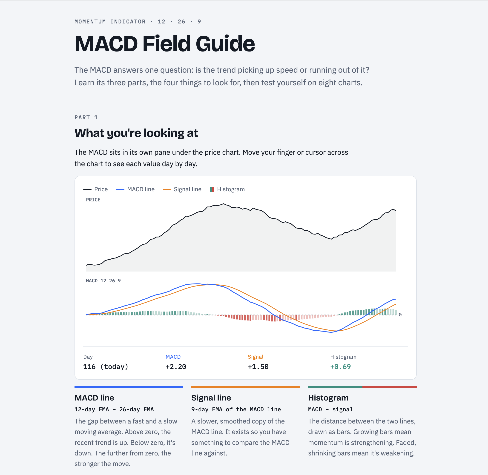
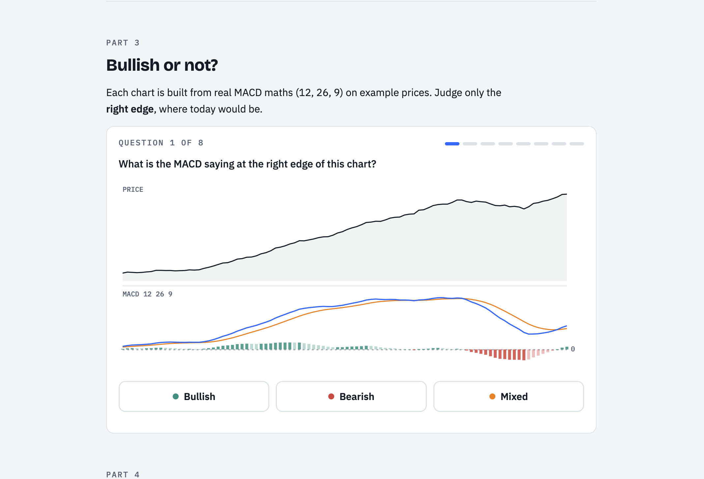

# Learning the MACD

A self-contained, interactive field guide for learning to read the **MACD** (Moving Average Convergence Divergence) momentum indicator, using the standard 12 · 26 · 9 settings.

The MACD answers one question: **is the trend picking up speed or running out of it?**

## What's inside

[`index.html`](index.html) is one HTML file with no dependencies. It covers:

1. **What you're looking at.** An interactive price + MACD chart you can hover over to see the MACD line, signal line and histogram values for each day.
2. **Four things to look for.** Crossovers, the zero line, histogram size and divergence, plus a table showing why *where* a crossover happens matters.
3. **Bullish or not?** An 8-question quiz on charts built from real MACD math, each with an explanation.
4. **Reading real charts.** Worked examples (AAOI and AXTI) that apply everything above.
5. **What the MACD can't tell you.** It lags, it fails in sideways markets, and it should always be read alongside price.

## Quick reference

| Part | Formula | What it tells you |
|---|---|---|
| MACD line | 12-day EMA − 26-day EMA | Above zero the recent trend is up; below zero it's down |
| Signal line | 9-day EMA of the MACD line | A smoothed copy to compare the MACD line against |
| Histogram | MACD − signal | Growing bars mean momentum is strengthening; shrinking bars mean it's fading |

## Disclaimer

This is for learning only. The example charts use generated prices, and nothing here is financial advice.
